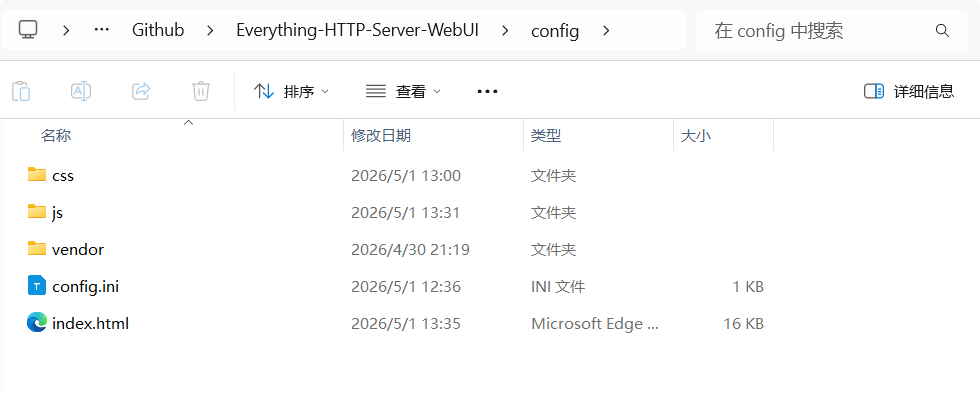
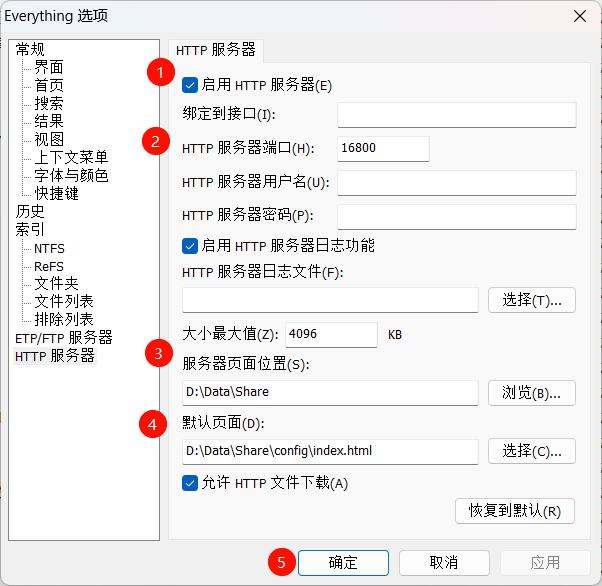
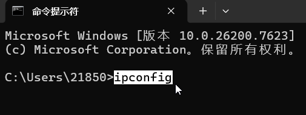
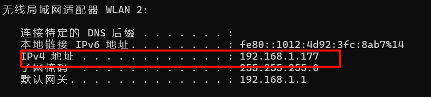
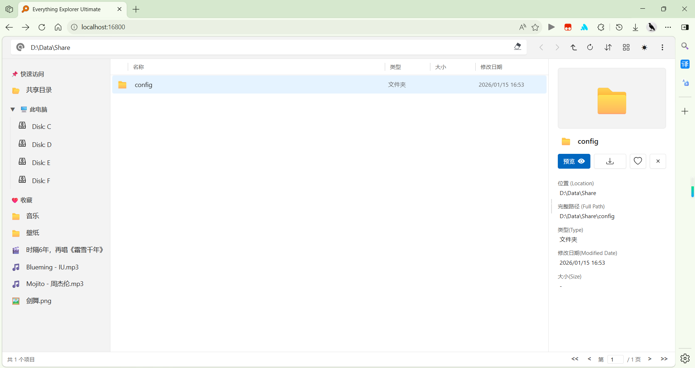
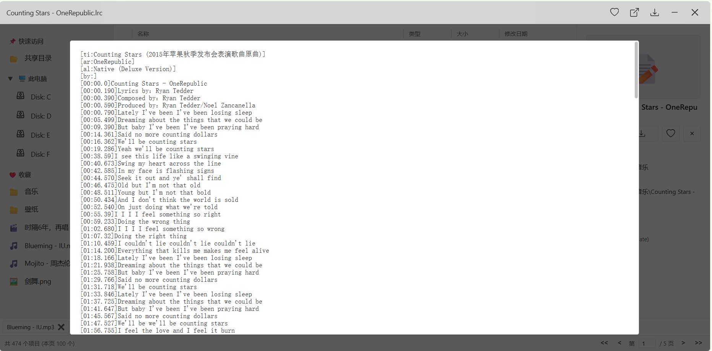
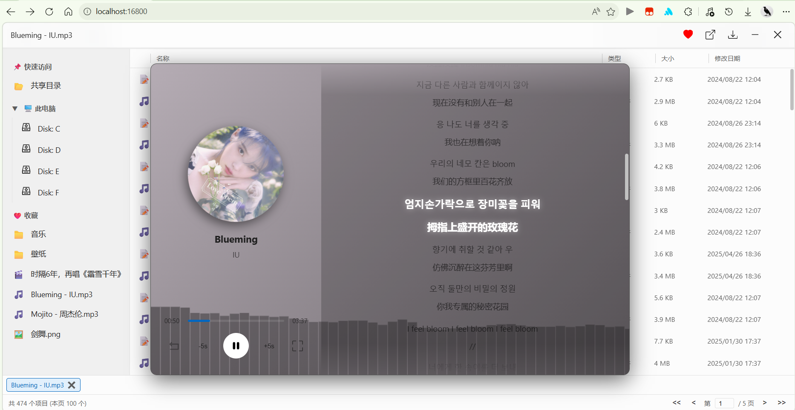
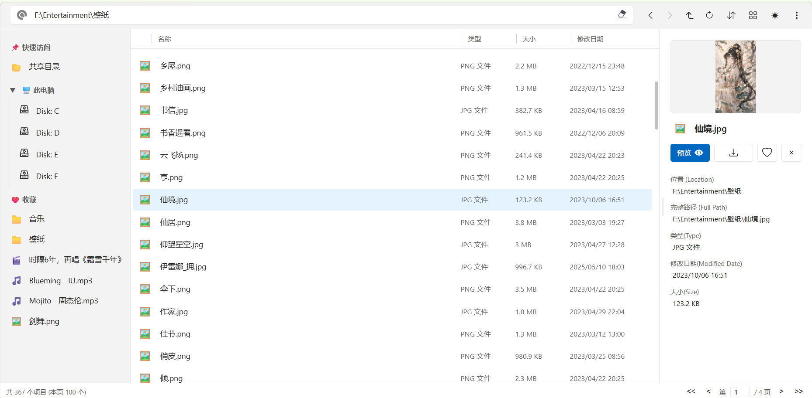
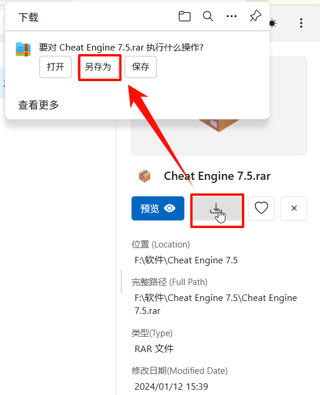
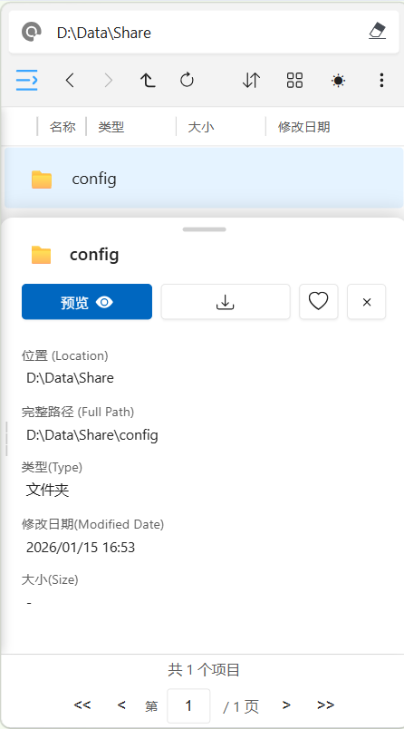

# Everything-HTTP Server-WebUI

Everything的HTTP服务器界面UI，支持文件预览/查看功能

## 使用方法

1. 下载
Everything-HTTP Server-WebUI压缩包并解压到指定位置，如：`D:\Data\Share\config`，注意文件目录结构：

2. 本地化
更改文件内容：打开`index.js`文件，修改默认位置`defaultPath`对应的值，上下文如图：

```js
const app = {
    config: {
        // 默认路径 Defaulut Path
        defaultPath: 'D:\\Data\\Share',
    },

```

注意路径中的反斜杠需要转义，如 `D:\Data\Share\config` 需要更改为`D:\\Data\\Share`
3. 配置
打开Everything软件，并开启Everything的HTTP服务器。配置如下：


4. 查找本机IP
获取ip的方式如下，打开命令行终端，输入ipconfig，即可获取ipv4地址


5. 成功
在浏览器输入ip+端口号即可载入界面!
例如：`192.168.1.177:16800`
【注意：需要在相同的局域网下】


## 功能

1. 查找文件（支持正则表达式）
`F:\Entertainment\音乐`：进入该文件夹
`folder:regex:^音乐$`：精确匹配名为“音乐”的文件夹
`regex:(^[0-9]{2}$)`：匹配名称仅由“2个数字”组成的字符
串
2. 文件预览
文本查看[包括：`txt`、`json` 等多种格式]

图片查看

文本查看[如：pdf]
音乐查看
视频查看
3. 侧边信息栏

4. 文件下载

5. 适配移动端

