# Everything-HTTP Server-WebUI

Everything的HTTP服务器界面UI，支持文件预览/查看功能

## 使用方法

### 下载

Everything-HTTP-Server-WebUI压缩包并解压到指定位置，复制config文件夹到指定位置，如：`D:\Data\Share`，注意文件目录结构：

```text
config/
  index.html
  config.ini
  css/
  js/
  vendor/
```

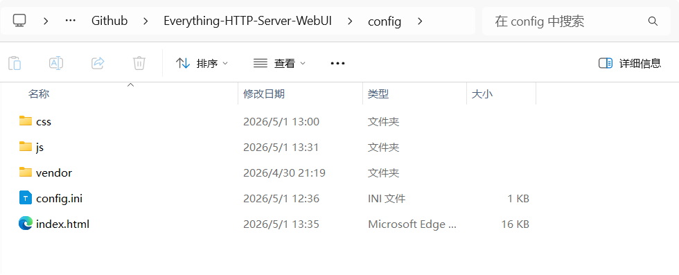

### 本地化

打开 `config/config.ini`，修改 `defaultPath`：

```ini
defaultPath=D:\Data\Share
```

`defaultPath` 是 WebUI 页面加载后默认进入的文件夹。可以直接从 Windows 资源管理器复制路径后粘贴到这里。

区分：

| 设置                           | 控制什么                           |
| :----------------------------- | :--------------------------------- |
| Everything 服务器页面位置      | WebUI 的网页文件放在哪里           |
| Everything 默认页面            | 打开 HTTP 服务时先显示哪个 HTML    |
| config.ini 的 defaultPath      | WebUI 页面加载后默认进入哪个文件夹 |

### 配置

打开Everything软件，并开启Everything的HTTP服务器。配置如下：
  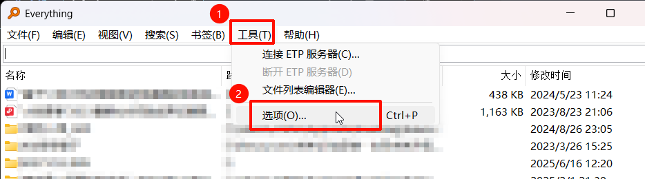

  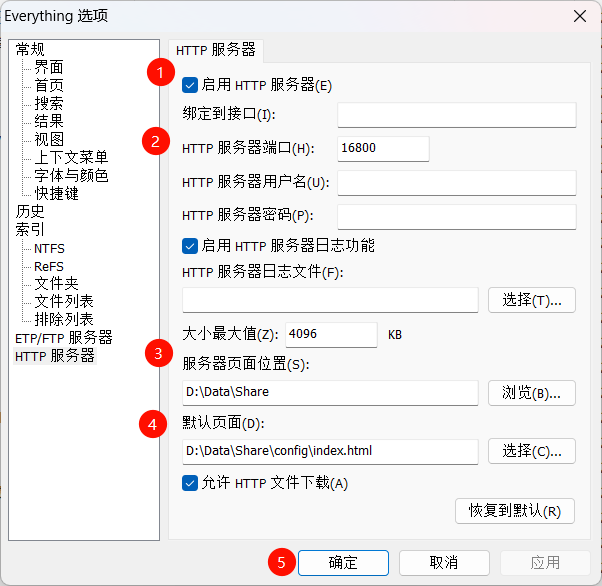

建议配置用户名和密码！！！

### 查找本机IP

获取ip的方式如下，打开命令行终端，输入ipconfig，即可获取ipv4地址
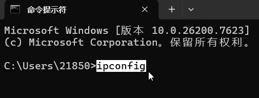
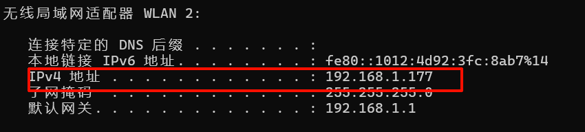

### 打开

在浏览器输入ip+端口号即可载入界面!
例如：`192.168.1.177:16800`
【注意：需要在相同的局域网下】
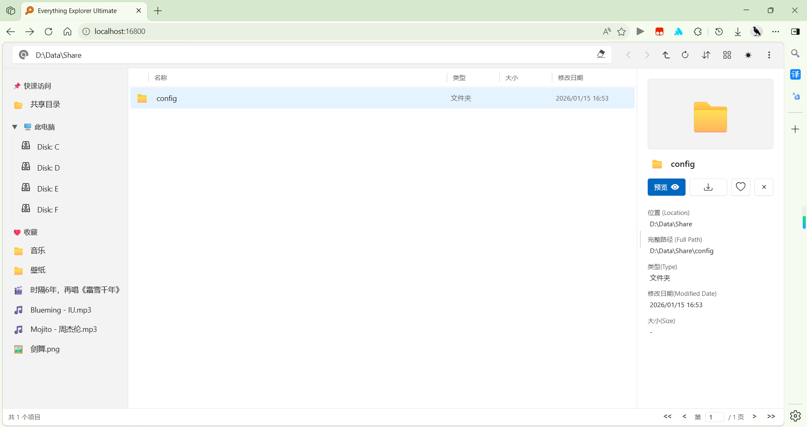

## 功能

### 顶部导航栏

- 导航按钮：前进、后退、上一级、刷新等
- 搜索框、清除按钮
- 功能：排序、视图、深色模式、设置

### 查找文件（支持正则表达式）

`F:\Entertainment\音乐`：进入该文件夹
`folder:regex:^音乐$`：精确匹配名为“音乐”的文件夹
`regex:(^[0-9]{2}$)`：匹配名称仅由“2个数字”组成的字符
串

### 文件预览

> 支持：空格快捷键快速预览、ESC快捷键最小化

文本查看[包括：`txt`、`json` 等多种格式]
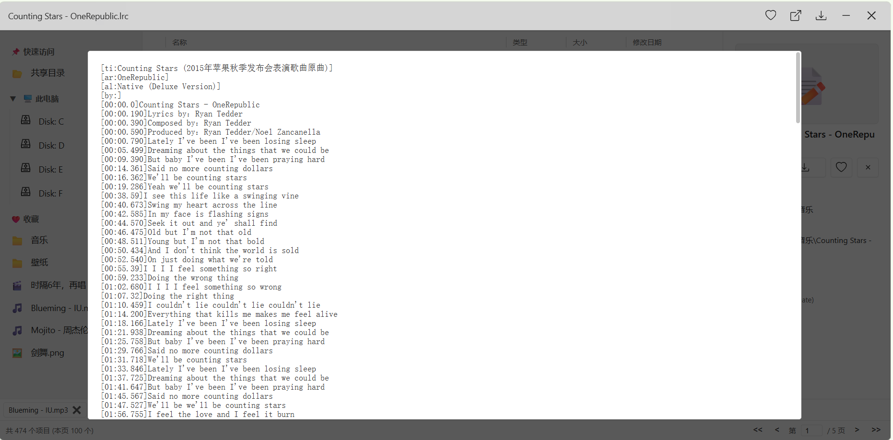
图片查看
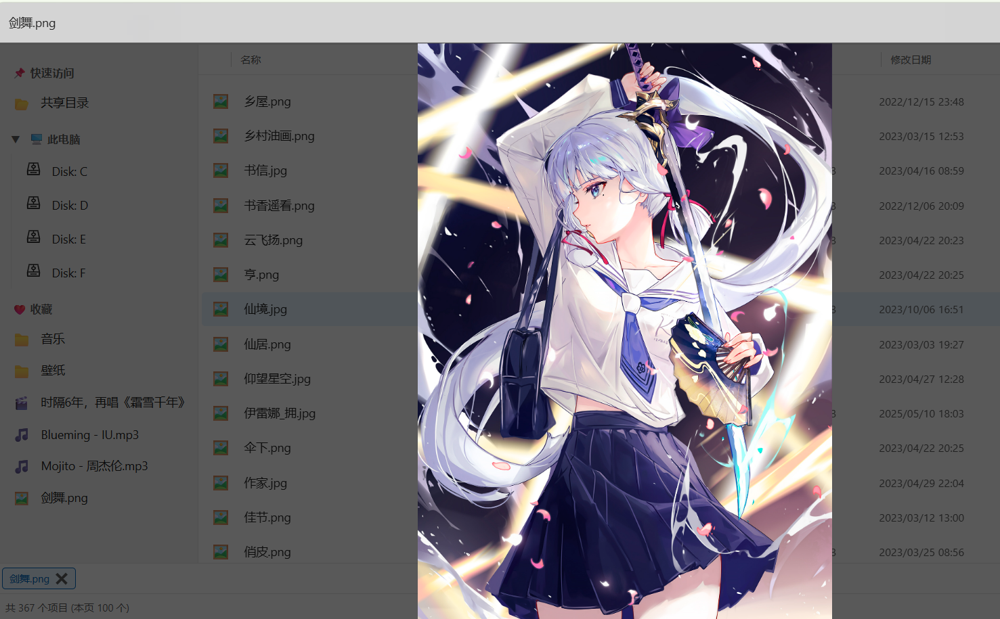
文本查看[如：pdf]
音乐查看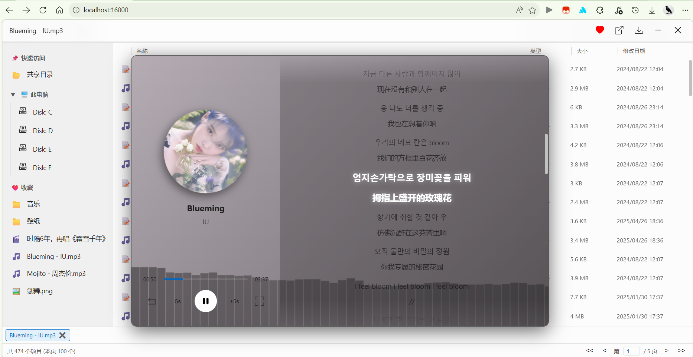
视频查看

### 侧边信息栏

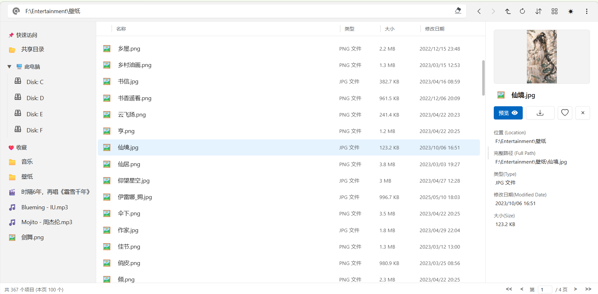

### 文件下载

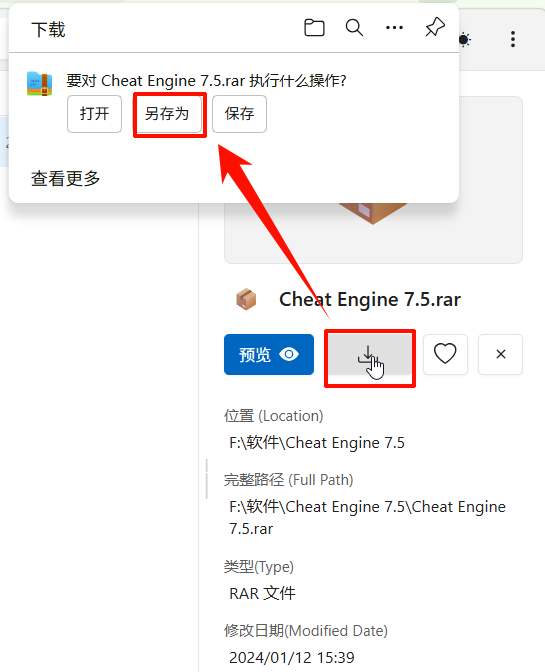

【文件夹下载测试中……】

### 适配移动端

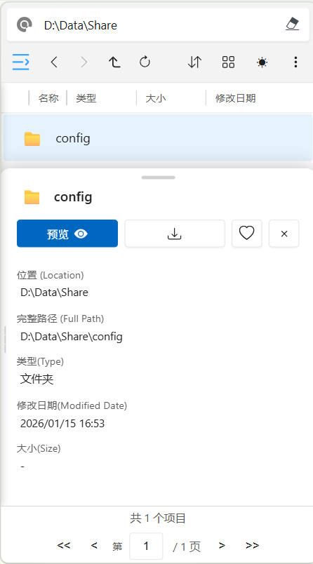
